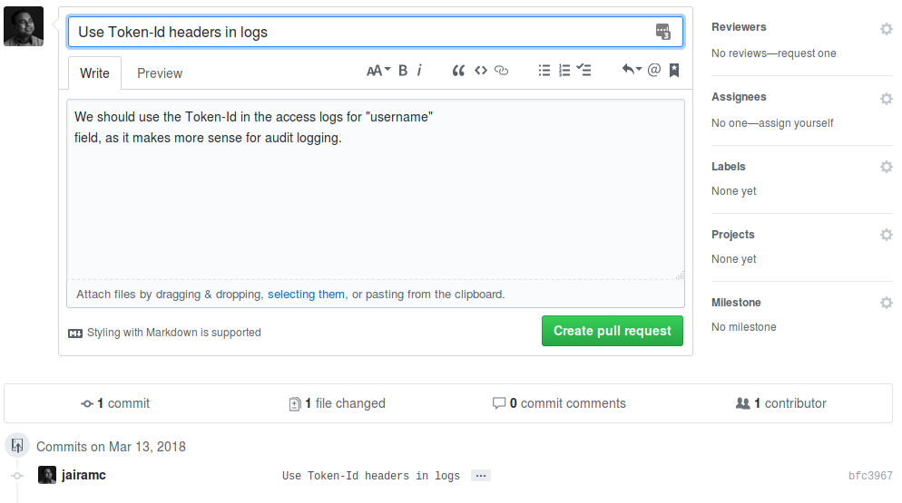

% Better Git Usage
% Jairam Chandar
% 2018-03-14


## What is Version Control?

_Version control is a system that records changes to a file or set of files over 
time so that you can recall specific versions later_

# Part 1

# Version Control

## Local Version Control

{ width=50% }

## Centralized Version Control

{ width=50% }

## Distributed Version Control

{ width=40% }


# Git

## Brief History

_As with many great things in life, Git began with a bit of creative destruction
 and fiery controversy._

    GIT - the stupid content tracker

    "git" can mean anything, depending on your mood.

    - random three-letter combination that is pronounceable, and not
    actually used by any common UNIX command.  The fact that it is a
    mispronounciation of "get" may or may not be relevant.
    - stupid. contemptible and despicable. simple. Take your pick from the
    dictionary of slang.
    - "global information tracker": you're in a good mood, and it actually
    works for you. Angels sing, and a light suddenly fills the room. 
    - "goddamn idiotic truckload of sh*t": when it breaks

[The very first Git Commit](https://github.com/git/git/commit/e83c5163316f89bfbde7d9ab23ca2e25604af290?diff=unified#diff-c47c7c7383225ab55ff591cb59c41e6b)

# Usage

## The Main Commands

> - `git clone`: Make a local copy of a Git Repo
> - `git pull`: Pull changes from remote server to local copy
> - `git push`: Push local changes to remote server
> - `git checkout`: Create and change branches
> - `git merge`: Merge changes from other branches/versions
> - `git add`: Prepare changes to be committed
> - `git commit`: Commit changes (create the next version)

# Part 2

# Better Commit Messages

---


## Structure of a Commit Message

    Summary of commit, maximum 50 characters

    Description of commit. This can be of any number of lines, with paragraphs
    and any other formatting you like. The one restriction is that the maximum 
    line-length is about 72 characters.
    
    Closes FTA-239

# The Commit Summary

## Purpose

To provide a concise *summary* of the commit's changes.

## Project History

    $ git log --oneline --no-merges

    a188091 Remove debug log messages that leaked token info
    100455c Add initial integration test suite
    6044db8 Major refactoring of tokauth to new specifications
    cf628a4 Tell jDBI how to return an Option of results
    ebb9188 Provide a default mapper for JacksonDeserializer
    ac9df88 Fix not correctly initialising Kafka Deserializers
    c145740 Fix multi-threaded access in Kafka Consumer

## Pull Request Title

\ 

## Rules

- First line of commit message
- One line, no wrapping
- **50 characters** maximum
- Don't end the line with a full-stop
- Capitalise first letter
- Use "commands" rather than "descriptions"

. . .

  ----------------------------------------- -------- -------- ---------------------------------------
  <span style="color:green">&#x2713;</span> Add          Adds <span style="color:red">&#x2715;</span>
  <span style="color:green">&#x2713;</span> Update    Updated <span style="color:red">&#x2715;</span>
  <span style="color:green">&#x2713;</span> Remove   Removing <span style="color:red">&#x2715;</span>
  ----------------------------------------- -------- -------- ---------------------------------------

# The Commit Description

## Purpose

To provide *an explanation* of the changes made.

> - The diff communicates **what** changed
> - The description communicates:
>     + _**why** the change was made_
>     + _**how** the change works_
>     + _**what** impact the change has_
> - Include references to tickets _at the end_

## Pull Request Description

\ 

## Rules

- **72 characters** per-line maximum
- Don't repeat the summary line
- Use of paragraphs and lists encouraged
- Use Markdown syntax for:
    + Punctuation (sparingly)
    + Code-blocks

# Writing Good Commit Messages

## The `git` Command

> - Never use `git commit -m 'message'`:
>     + Overly terse
>     + No description
>     + Discourages you from _thinking_ about your commit
> - Use `git commit`:
>     + Uses your default `EDITOR`, usually VI
>     + Cancel commit by quitting editor without saving or saving a blank 
        message.

## The Editor (VIM)

\


## The Editor (VIM)

\


## The Commit Message

The complexity of the commit message should reflect the complexity of the 
change:

. . .

- Single-line messages are fine for _trivial_ changes
    + Fixing a typo
    + Making whitespace changes
    + Tidying up mundane code (comments, imports etc.)

## One Change, One Commit

Commits should ideally be:

Complete
  ~ all the modifications required for a logical change

Consistent
  ~ the modifications are for only a single logical change

Correct
  ~ the result compiles and passes all tests

## The CLI is your friend

> - Use `git diff` and `git add` to select files to stage
> - Use `git add --patch` (aka. `git add -p`)
>     + Interactively stages chunks of changed files
> - Use a local WIP branch for more complex work
>     + Rebase and squash your commits before pushing
>     + Ensure squashed commit message is well-written
>     + Use `git commit --amend` to edit message

# Real-world examples

## Bad

    Major overhaul

. . .

    298 additions and 609 deletions.

---


## Good

    Refactor namespace parsing in rapidjson parser

    Currently, while recursively parsing interaction objects, a `namespaces`
    stack is maintained with the fully qualified name of each namespace.

    Example:

    ```json
    {"a": { "b": { "c": { "d": 123 } } } }
    ```

    For the above JSON, the following elements will be pushed on to the
    namespaces stack:

    ```
    a
    a.b
    a.b.c
    a.b.c.d
    ```

    Only leaf nodes in the object tree are valid targets (`a.b.c.d` in our
    example), the other elements serving only as a prefix to the next.

    Constructing these intermediary namespaces is expensive, because the
    string appends create a bunch of temporaries, and this occurs for every
    branch node, not just the leaves.

    This refactoring instead places just the node itself on the stack, when
    a leaf node is reached the fully-qualified target is materialized by
    iterating the stack and joining the elements with the separator.

    For our above example, the following stack would be maintained:

    ```
    a
    b
    c
    d
    ```

    At which point, the `build_target` method will be used to walk the stack
    and generate `a.b.c.d` as the target name for the leaf node.

    Note: `build_target` is a custom implementation similar to
    `boost::algorithm::join`, this permits us to pre-allocate an estimate
    for the size of the target before joining, substantially reducing
    re-allocation overhead.

## Results in 

{ width=60% }\


## I'm a Bad Person

     Merge branch 'develop' into fix/refactor-namespace-parsing

                            much change.
        so confuse.
                                wow.

---

## References

Pro Git
:   Scott Chacon and Ben Straub
:   https://git-scm.com/book/ch5-2.html

How to Write a Git Commit Message
:   Chris Beams
:   http://chris.beams.io/posts/git-commit/


